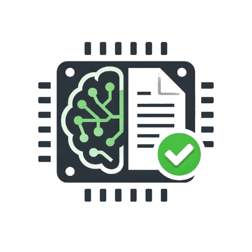
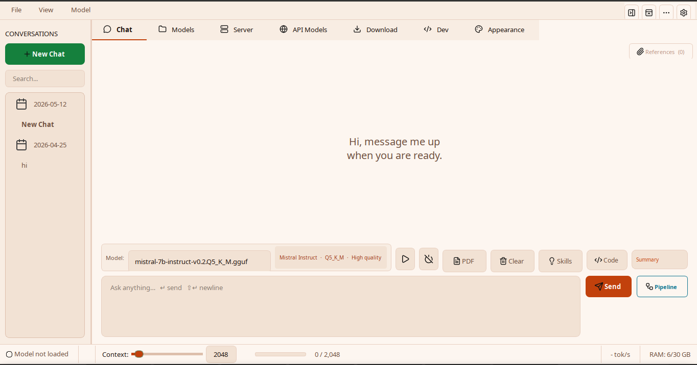
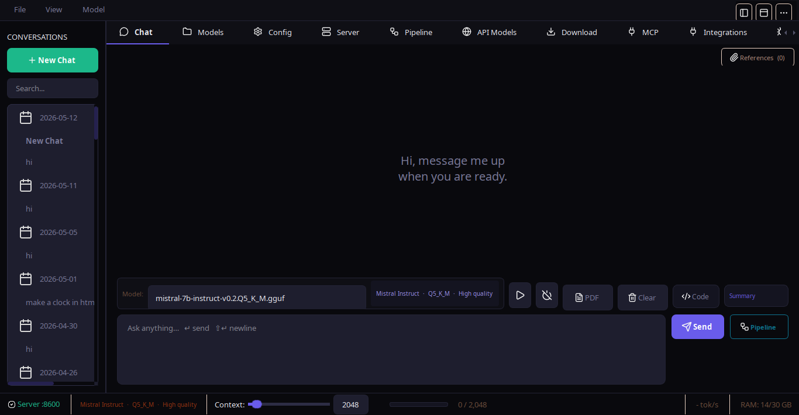
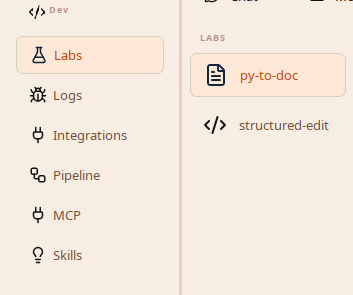
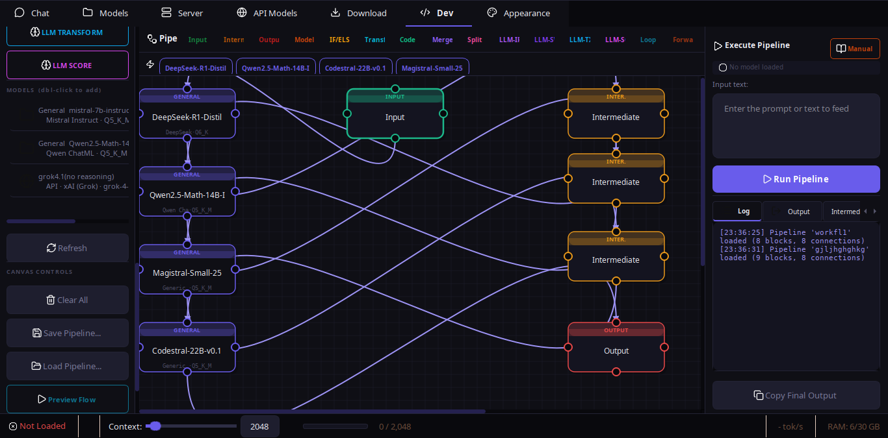
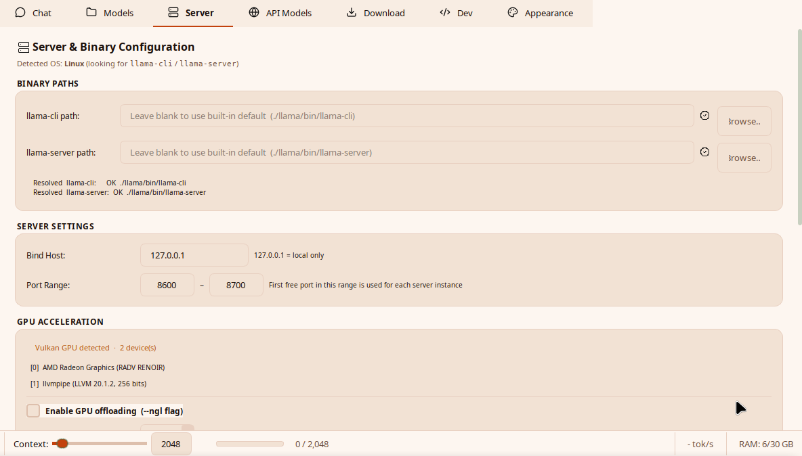
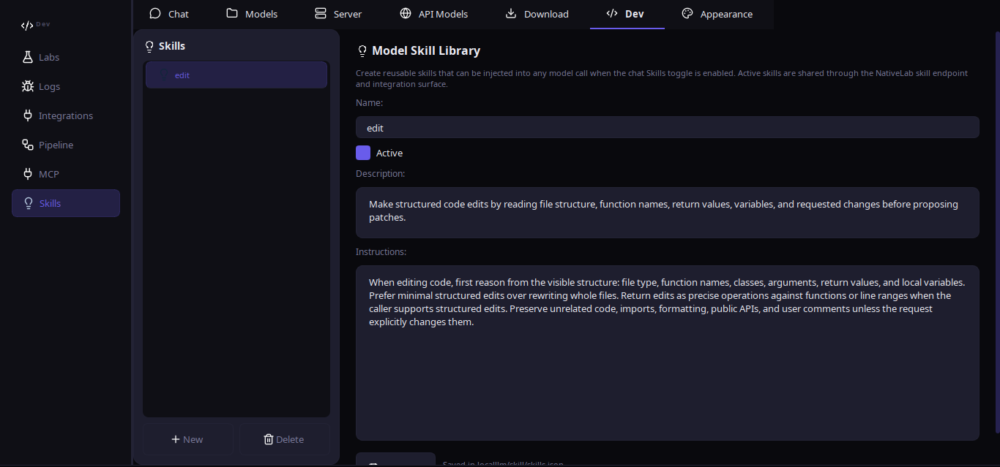
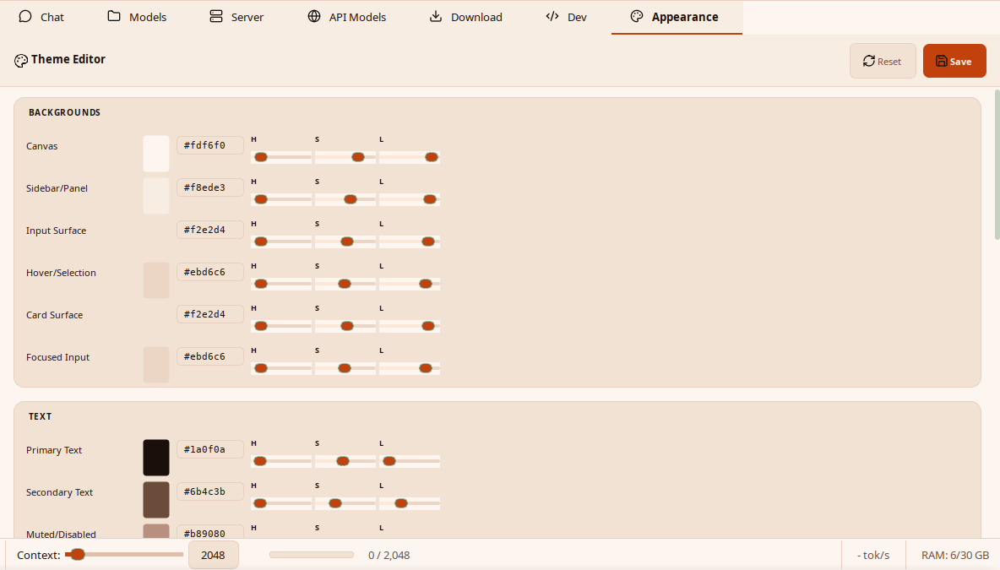

<div align="center">



# NativeLab

**Un banco de trabajo de LLM totalmente local y centrado en la privacidad impulsado por llama.cpp: GUI de escritorio, CLI de terminal y una capa de experimentación.**

[](https://pypi.org/project/nativelab/)
[](https://pypi.org/project/nativelab/)

[](LICENSE)
[](#)
[](https://github.com/ggerganov/llama.cpp)
[](https://github.com/7ZoneSystems/NativeLab/stargazers)
[](https://github.com/7ZoneSystems/NativeLab/pulls)
[](https://github.com/7ZoneSystems/NativeLab/commits/main)
[](https://github.com/7ZoneSystems/NativeLab/issues)
[](https://github.com/7ZoneSystems/NativeLab/graphs/contributors)
[](https://github.com/7ZoneSystems/NativeLab)
[](https://pepy.tech/projects/nativelab)
</div>

---

NativeLab es un cliente de escritorio y terminal para ejecutar modelos de lenguaje extensos (LLM) totalmente en tu máquina. Envuelve [llama.cpp](https://github.com/ggerganov/llama.cpp), ejecutando modelos de Ollama, modelos opcionales de Hugging Face Transformers y backends de API detrás de una pulida GUI de PyQt6 **y** una CLI de terminal al estilo de Claude-Code, con soporte de primera clase para pipelines multi-modelo, referencias a documentos, resúmenes de documentos largos y una flamante capa de experimentación llamada **Labs**.

**PhonoLab** es el cliente oficial para Android: misma filosofía local-first, ejecuta llama.cpp en el dispositivo vía JNI, con una interfaz de chat, adjuntos de documentos, RAG, soporte para modelos de visión y un servidor de API LAN. Consulta [`PhonoLab/`](PhonoLab/) o la [página de PhonoLab](web_page/phonolab.html).

```bash
pip install nativelab
nativelab            # GUI
nativelab --cli      # centro de control de terminal (configuración, chat, modelos, labs, integraciones)

# Servidor local independiente (convierte cualquier GGUF en una API)
python -m nativelab.server --model models/llama-7b.gguf --port 8787 --host 0.0.0.0
```

---

## Capturas de pantalla de la aplicación

<div style="overflow-x:auto; white-space:nowrap; padding:12px 0 22px 0;">
  <figure id="slide-light" style="display:inline-block; width:960px; margin:0 18px 0 0; vertical-align:top;">
    <table>
      <tr>
        <td align="center" width="46"><a href="#slide-ui"><b>‹</b></a></td>
        <td align="center"></td>
        <td align="center" width="46"><a href="#slide-dark"><b>›</b></a></td>
      </tr>
    </table>
    <figcaption align="center"><sub><b>Espacio de chat claro</b></sub></figcaption>
  </figure>
  <figure id="slide-dark" style="display:inline-block; width:960px; margin:0 18px 0 0; vertical-align:top;">
    <table>
      <tr>
        <td align="center" width="46"><a href="#slide-light"><b>‹</b></a></td>
        <td align="center"></td>
        <td align="center" width="46"><a href="#slide-dev"><b>›</b></a></td>
      </tr>
    </table>
    <figcaption align="center"><sub><b>Modo oscuro</b></sub></figcaption>
  </figure>
  <figure id="slide-dev" style="display:inline-block; width:960px; margin:0 18px 0 0; vertical-align:top;">
    <table>
      <tr>
        <td align="center" width="46"><a href="#slide-dark"><b>‹</b></a></td>
        <td align="center"></td>
        <td align="center" width="46"><a href="#slide-pipeline"><b>›</b></a></td>
      </tr>
    </table>
    <figcaption align="center"><sub><b>Espacio de desarrollo</b></sub></figcaption>
  </figure>
  <figure id="slide-pipeline" style="display:inline-block; width:960px; margin:0 18px 0 0; vertical-align:top;">
    <table>
      <tr>
        <td align="center" width="46"><a href="#slide-dev"><b>‹</b></a></td>
        <td align="center"></td>
        <td align="center" width="46"><a href="#slide-server"><b>›</b></a></td>
      </tr>
    </table>
    <figcaption align="center"><sub><b>Constructor de pipelines</b></sub></figcaption>
  </figure>
  <figure id="slide-server" style="display:inline-block; width:960px; margin:0 18px 0 0; vertical-align:top;">
    <table>
      <tr>
        <td align="center" width="46"><a href="#slide-pipeline"><b>‹</b></a></td>
        <td align="center"></td>
        <td align="center" width="46"><a href="#slide-skills"><b>›</b></a></td>
      </tr>
    </table>
    <figcaption align="center"><sub><b>Controles del servidor</b></sub></figcaption>
  </figure>
  <figure id="slide-skills" style="display:inline-block; width:960px; margin:0 18px 0 0; vertical-align:top;">
    <table>
      <tr>
        <td align="center" width="46"><a href="#slide-server"><b>‹</b></a></td>
        <td align="center"></td>
        <td align="center" width="46"><a href="#slide-appearance"><b>›</b></a></td>
      </tr>
    </table>
    <figcaption align="center"><sub><b>Habilidades (Skills)</b></sub></figcaption>
  </figure>
  <figure id="slide-appearance" style="display:inline-block; width:960px; margin:0 18px 0 0; vertical-align:top;">
    <table>
      <tr>
        <td align="center" width="46"><a href="#slide-skills"><b>‹</b></a></td>
        <td align="center"></td>
        <td align="center" width="46"><a href="#slide-ui"><b>›</b></a></td>
      </tr>
    </table>
    <figcaption align="center"><sub><b>Apariencia</b></sub></figcaption>
  </figure>
  <figure id="slide-ui" style="display:inline-block; width:960px; margin:0 18px 0 0; vertical-align:top;">
    <table>
      <tr>
        <td align="center" width="46"><a href="#slide-appearance"><b>‹</b></a></td>
        <td align="center"></td>
        <td align="center" width="46"><a href="#slide-light"><b>›</b></a></td>
      </tr>
    </table>
    <figcaption align="center"><sub><b>IU de NativeLab</b></sub></figcaption>
  </figure>
</div>

---

## ✨ Aspectos Destacados

- 🖥️  **GUI de Escritorio** - Chat, biblioteca de modelos, constructor visual de pipelines, MCP, pestaña de Descargas, Labs, temas.
- ⌨️  **CLI de Terminal** - `nativelab --cli` abre un centro de control completo para chat, modelos locales/API, habilidades, Labs, pipelines guardados, integraciones, servicio de endpoints, incrustación de archivos `@file`, comandos de barra y linting.
- 🧪  **Labs** - Una capa de experimentación dedicada con una API de endpoints compartidos. Las nuevas funciones de lab obtienen estado del motor, cambio de modelo, cambio de contexto y llamadas a LLM gratuitamente.
- 🔌  **Integraciones** - Endpoint JSON local, navegador de rutas y perfiles de conector para bots de Discord/WhatsApp guardados.
- 🔗  **Constructor Visual de Pipelines** - Más de 20 tipos de nodos, presets de ejemplo incluidos, barras laterales redimensionables, generación de pipelines asistida por IA, ayudantes de grafos acelerados nativamente, registro de ejecución en vivo, guardar/cargar.
- 🌐  **Mezcla de Backend** - GGUF locales, modelos de Ollama, modelos opcionales de Hugging Face Transformers, APIs compatibles con OpenAI y endpoints de Anthropic comparten el mismo estado de la aplicación.
- 📱  **Descubrimiento de Dispositivos LAN** - Escanea tu red local en busca de dispositivos Android con PhonoLab, regístralos como endpoints de modelos API, redirige la inferencia a teléfonos y tabletas a través de WiFi.
- 🔐  **Inicio de sesión en Hugging Face** - Inicio de sesión en el navegador con un solo clic para repositorios privados o restringidos, con pegado de token de acceso como alternativa avanzada.
- ⚡  **Modo Paralelo + Pipeline** - Ejecuta motores de razonamiento y codificación simultáneamente y encadénalos automáticamente.
- 🧠  **Detección Automática de Familias** - Más de 20 familias de modelos reconocidas a partir del nombre del archivo; se aplica la plantilla de prompt correcta.
- 📦  **Descargadores** - Elige presets populares o IDs personalizados para GGUFs, snapshots completos de HF Transformers, modelos de Ollama y binarios de llama.cpp sin salir de la aplicación.
- 🖧  **Aplicación de Servidor Local** - `python -m nativelab.server` convierte cualquier modelo GGUF en un servidor API compatible con OpenAI/Anthropic. Autoconfiguración consciente del hardware.

> Consulta [changelog.txt](changelog.txt) para las notas de la versión más reciente y [docs/architecture.md](docs/architecture.md) para el diseño por capas.

---

## PhonoLab - Cliente de Android

<div align="center">

**Ejecuta LLMs locales en tu teléfono.** PhonoLab lleva la experiencia de NativeLab a Android.

[Página de PhonoLab](web_page/phonolab.html) · [Código fuente](PhonoLab/) · [Documentación de Android](PhonoLab/docs/README.md)

</div>

| Función | Detalles |
|---------|---------|
| Inferencia en el dispositivo | llama-server empaquetado vía fork+execve de JNI, sin problemas de W^X |
| IU de Chat | Estilo ChatGPT con barra lateral, sesiones, renderizado matemático (KaTeX) |
| Adjuntos de documentos | PDF, texto, DOCX - fragmentación RAG + recuperación por palabras clave |
| Adjuntos de imágenes | Selector de galería, soporte para modelos de visión (Llama 3.2 Vision, etc.) |
| Catálogo de modelos | Modelos pequeños integrados: SmolLM2, Qwen, Llama 3.2, TinyLlama |
| Servidor API LAN | Compatible con OpenAI + Anthropic, streaming SSE, cola de solicitudes |
| Reporte del dispositivo | CPU, RAM, almacenamiento, estado del modelo vía endpoint /device |
| Edición de parámetros | Temperature, top_k, top_p, repeat_penalty vía endpoint /config |
| Recarga inteligente | Cola de solicitudes durante el cambio de modelo, vaciado automático al estar listo |
| Seguridad ante errores | model_not_loaded, server_busy, gateway_timeout - nunca pantallas en blanco |
| Temas | Oscuro (NativeLab Studio) + Claro (Cream & Sage) |
| Manejo de errores | Sistema de errores de 17 capas, diálogo de reinicio, notificaciones de banner rojo |
| Gratis para siempre | AGPL v3 - igual que NativeLab |

---

## 📚 Documentación

La documentación está dividida en archivos cortos y enfocados para que puedas ir directamente a lo que necesites.

| Página | Qué hay dentro |
|---|---|
| [docs/README.md](docs/spanish/README.md) | Índice de documentación con resúmenes de una línea. |
| [docs/installation.md](docs/spanish/installation.md) | Instalación, configuración de llama.cpp, primer espacio de trabajo. |
| [docs/cli.md](docs/spanish/cli.md) | `nativelab --cli` - referencia rápida + enlace a la guía para principiantes. |
| [docs/features.md](docs/spanish/features.md) | Catálogo completo de funciones; las notas de la versión más reciente están en `changelog.txt`. |
| [docs/pipeline-builder.md](docs/spanish/pipeline-builder.md) | Constructor visual de pipelines, AI Builder, ejemplos, esquema JSON, núcleo de pipeline nativo. |
| [docs/architecture.md](docs/spanish/architecture.md) | Arquitectura por capas, estructura del proyecto, flujo de datos. |
| [docs/labs.md](docs/spanish/labs.md) | La capa de experimentación Labs + cómo añadir una función. |
| [docs/integrations.md](docs/spanish/integrations.md) | Rutas de endpoints de integración, puente HTTP local, conectores de bots de Discord y WhatsApp. |
| [docs/models.md](docs/spanish/models.md) | Registro de modelos, familias, cuantización, modelos de API. |
| [docs/workflows.md](docs/spanish/workflows.md) | Pipelines, referencias, resúmenes, MCP, descargas de modelos/runtime. |
| [docs/ui.md](docs/spanish/ui.md) | Recorrido por la GUI, temas, atajos, persistencia de datos. |
| [docs/troubleshooting.md](docs/spanish/troubleshooting.md) | Errores comunes y sus soluciones. |

Guías paso a paso para principiantes:

- 🆕 **¿Nunca has usado una herramienta de LLM en terminal?** Comienza con [nativelab/cli/cli_guide.md](nativelab/spanish/cli/cli_guide.md).
- 🆕 **¿Quieres añadir una función de lab?** Lee [docs/labs.md](docs/spanish/labs.md).

---

## ⚡ Inicio Rápido

### GUI

```bash
pip install nativelab
nativelab
```

El primer lanzamiento abre la aplicación de escritorio. Usa la pestaña **Download** para instalar los binarios de llama.cpp, obtener un modelo GGUF, traer un modelo de Ollama desde un demonio de Ollama ya en ejecución o descargar un snapshot completo de HF Transformers. El descargador de HF Transformers incluye un instalador de librerías interno para los paquetes opcionales de runtime de Transformers. Para repositorios restringidos/privados de Hugging Face, inicia sesión primero desde **Settings > Accounts > Hugging Face > Login with Hugging Face**, y luego acepta o solicita acceso en la página del repositorio si Hugging Face sigue devolviendo un error 403.

### CLI

```bash
pip install nativelab
nativelab --cli
```

La CLI ejecuta un asistente interactivo la primera vez:

1. Verifica que `llama-server` / `llama-cli` estén presentes (o te guía para instalarlos).
2. Te permite elegir o descargar un modelo GGUF desde HuggingFace.
3. Solicita un tamaño de contexto con valores predeterminados sensatos.
4. Abre el centro de control de la terminal con Chat, Modelos, Modelos de API, Habilidades, Labs, Pipelines, Integraciones, Estado y Configuración.

```text
nativelab --cli models list
nativelab --cli api-models list
nativelab --cli skills chat-on
nativelab --cli endpoint /snapshot --json
nativelab --cli chat
```

Recorrido completo para principiantes: [nativelab/cli/cli_guide.md](nativelab/spanish/cli/cli_guide.md).

---

## 🧪 Labs - la capa de experimentación

El paquete `nativelab/labs/` es un sandbox para nuevas funciones. Cada panel de lab recibe una instancia única de `LabEndpoints` y la utiliza para **toda** la interacción con el motor:

```python
from nativelab.labs import LabEndpoints

# Leer estado
endpoints.status_text     # "🟢 Server  :8612"
endpoints.model_path      # "/abs/path/to/mistral-7b.Q4_K_M.gguf"
endpoints.snapshot()      # {model_name, ctx_value, server_port, …}

# Llamada sincrónica al LLM - redirige automáticamente API > server > CLI
endpoints.call_llm(messages=[...], system_prompt="…")

# Enrutamiento inverso - pide a la app anfitriona que cambie el estado
endpoints.request_load_model("/path/to/other.gguf")
endpoints.request_context(8192)
endpoints.request_unload()
```

Añade una función de lab colocando un archivo `nativelab/labs/<feature>.py` con un panel `QWidget` que tenga `LAB_NAME`, `LAB_ICON` y un método `set_endpoints(...)`, y luego añádelo a `LAB_FEATURES`. Guía completa en [docs/labs.md](docs/spanish/labs.md).

---

## 🛠️ Requisitos

- **Python 3.10+**
- **PyQt6** (se instala automáticamente como dependencia)
- **Binarios de llama.cpp** - `llama-server` / `llama-cli`. La pestaña de Descargas de la GUI los instala por ti, o puedes colocarlos en `./llama/bin/`.
- Opcional: `psutil` (monitor de RAM), `pypdf` (resúmenes de PDF), `pyflakes` / `flake8` / `pylint` (lint de CLI).
- Backend de HF opcional: usa la acción **Install Libraries** del descargador de HF Transformers, o instala manualmente el comando de Transformers/Torch/safetensors/Accelerate/SentencePiece/Pillow mostrado.

Instrucciones detalladas en [docs/installation.md](docs/spanish/installation.md).

---

## 🤝 Contribuir

Se agradecen los Issues y PRs. Consulta [CONTRIBUTING.md](CONTRIBUTING.md) y [CODE_OF_CONDUCT.md](CODE_OF_CONDUCT.md).

Para divulgaciones de seguridad, consulta [SECURITY.md](SECURITY.md).

---

## 📜 Licencia

**AGPL v3 - libre y de código abierto para siempre.** Consulta [LICENSE](LICENSE).

Tanto NativeLab como PhonoLab están licenciados bajo AGPL v3. NativeLab depende de [llama.cpp](https://github.com/ggerganov/llama.cpp) (MIT) y [PyQt6](https://www.riverbankcomputing.com/software/pyqt/) (GPL/comercial). PhonoLab depende de llama.cpp (MIT) y AndroidX (Apache 2.0).

---

<div align="center">

**Construido para personas que quieren sus LLMs locales, rápidos y bajo su propio control.**

[Instalar NativeLab](https://pypi.org/project/nativelab/) · [Obtener PhonoLab](PhonoLab/) · [GitHub](https://github.com/7ZoneSystems/NativeLab) · [Docs](docs/README.md) · [Issues](https://github.com/7ZoneSystems/NativeLab/issues)

</div>
