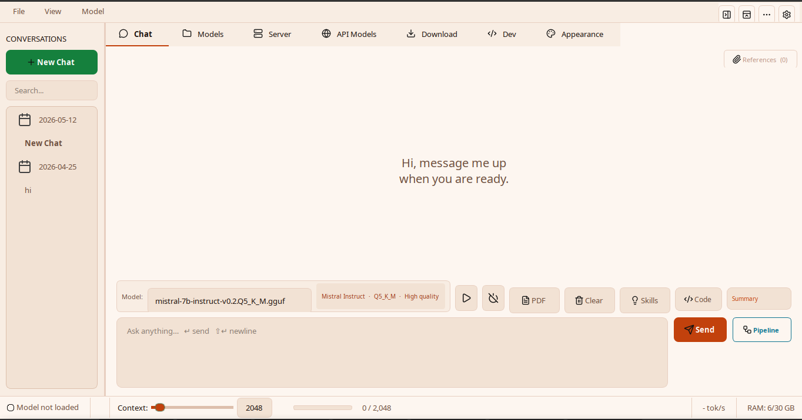
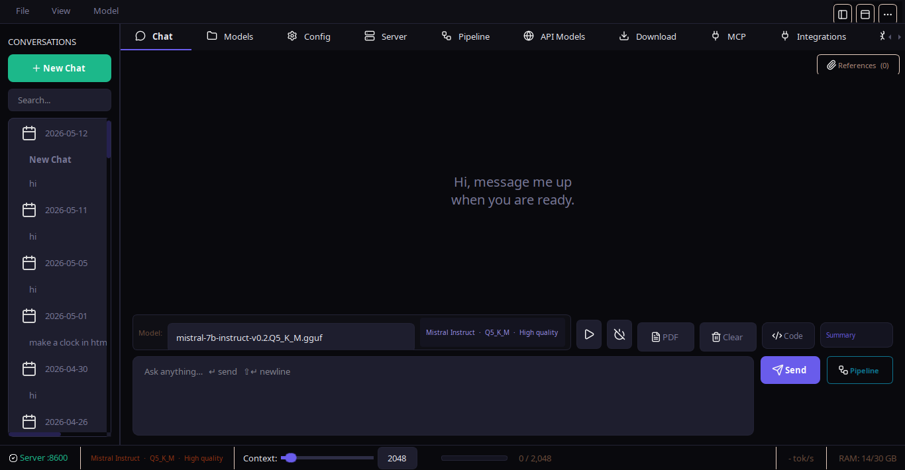
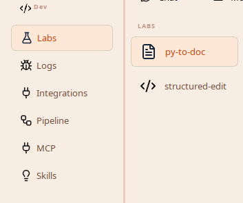
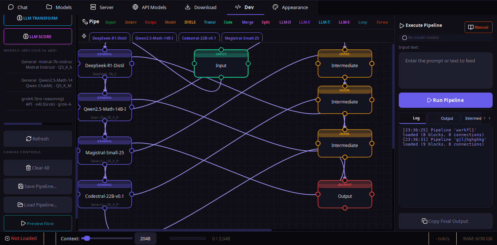
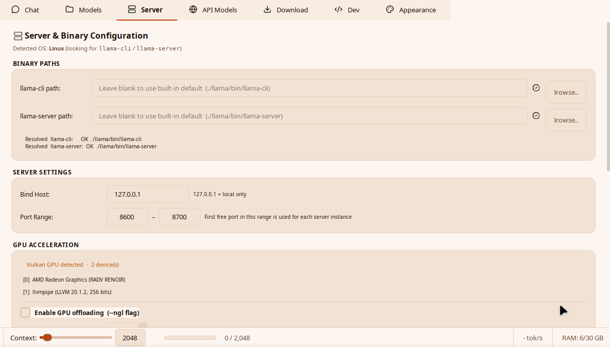
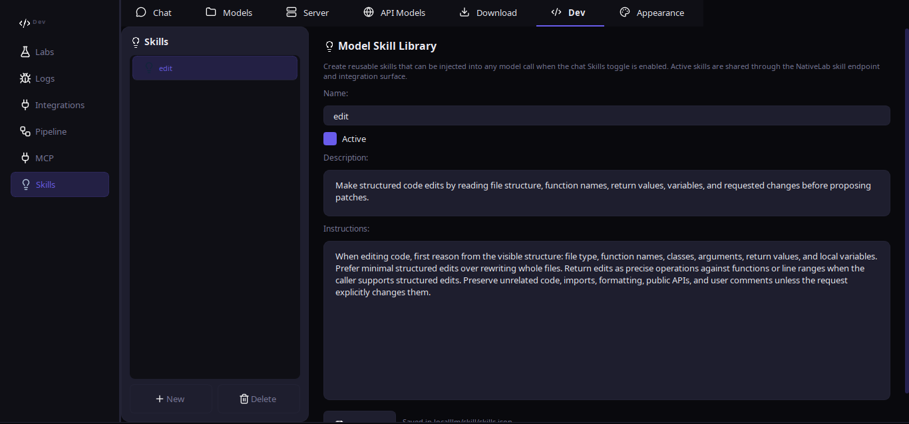
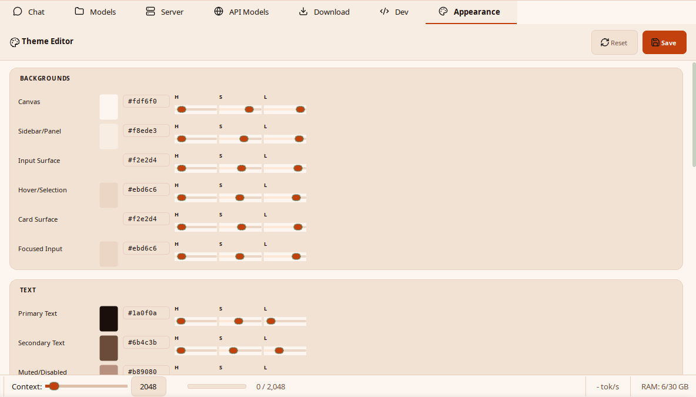

<div align="center">


# NativeLab

**A fully local, privacy-first LLM workbench powered by llama.cpp - desktop GUI, terminal CLI, and an experimentation layer.**

[](https://pypi.org/project/nativelab/)
[](https://pypi.org/project/nativelab/)

[](LICENSE)
[](#)
[](https://github.com/ggerganov/llama.cpp)
[](https://github.com/7ZoneSystems/NativeLab/stargazers)
[](https://github.com/7ZoneSystems/NativeLab/pulls)
[](https://github.com/7ZoneSystems/NativeLab/commits/main)
[](https://github.com/7ZoneSystems/NativeLab/issues)
[](https://github.com/7ZoneSystems/NativeLab/graphs/contributors)
[](https://github.com/7ZoneSystems/NativeLab)
[](https://pepy.tech/projects/nativelab)
</div>

---

NativeLab is a desktop and terminal client for running large language models entirely on your machine. It wraps [llama.cpp](https://github.com/ggerganov/llama.cpp), running Ollama models, optional Hugging Face Transformers models, and API backends behind a polished PyQt6 GUI **and** a Claude-Code-style terminal CLI, with first-class support for multi-model pipelines, document references, long-document summarization, and a brand-new **Labs** experimentation layer.

**PhonoLab** is the official Android client - same local-first philosophy, runs llama.cpp on-device via JNI, with a chat UI, document attachments, RAG, vision model support, and a LAN API server. See [`PhonoLab/`](PhonoLab/) or the [PhonoLab page](web_page/phonolab.html).

```bash
pip install nativelab
nativelab            # GUI
nativelab --cli      # terminal control center (setup, chat, models, labs, integrations)

# Standalone local server (turn any GGUF into an API)
python -m nativelab.server --model models/llama-7b.gguf --port 8787 --host 0.0.0.0
```

---

## App screenshots

<div style="overflow-x:auto; white-space:nowrap; padding:12px 0 22px 0;">
  <figure id="slide-light" style="display:inline-block; width:960px; margin:0 18px 0 0; vertical-align:top;">
    <table>
      <tr>
        <td align="center" width="46"><a href="#slide-ui"><b>‹</b></a></td>
        <td align="center"></td>
        <td align="center" width="46"><a href="#slide-dark"><b>›</b></a></td>
      </tr>
    </table>
    <figcaption align="center"><sub><b>Light chat workspace</b></sub></figcaption>
  </figure>
  <figure id="slide-dark" style="display:inline-block; width:960px; margin:0 18px 0 0; vertical-align:top;">
    <table>
      <tr>
        <td align="center" width="46"><a href="#slide-light"><b>‹</b></a></td>
        <td align="center"></td>
        <td align="center" width="46"><a href="#slide-dev"><b>›</b></a></td>
      </tr>
    </table>
    <figcaption align="center"><sub><b>Dark mode</b></sub></figcaption>
  </figure>
  <figure id="slide-dev" style="display:inline-block; width:960px; margin:0 18px 0 0; vertical-align:top;">
    <table>
      <tr>
        <td align="center" width="46"><a href="#slide-dark"><b>‹</b></a></td>
        <td align="center"></td>
        <td align="center" width="46"><a href="#slide-pipeline"><b>›</b></a></td>
      </tr>
    </table>
    <figcaption align="center"><sub><b>Dev workspace</b></sub></figcaption>
  </figure>
  <figure id="slide-pipeline" style="display:inline-block; width:960px; margin:0 18px 0 0; vertical-align:top;">
    <table>
      <tr>
        <td align="center" width="46"><a href="#slide-dev"><b>‹</b></a></td>
        <td align="center"></td>
        <td align="center" width="46"><a href="#slide-server"><b>›</b></a></td>
      </tr>
    </table>
    <figcaption align="center"><sub><b>Pipeline builder</b></sub></figcaption>
  </figure>
  <figure id="slide-server" style="display:inline-block; width:960px; margin:0 18px 0 0; vertical-align:top;">
    <table>
      <tr>
        <td align="center" width="46"><a href="#slide-pipeline"><b>‹</b></a></td>
        <td align="center"></td>
        <td align="center" width="46"><a href="#slide-skills"><b>›</b></a></td>
      </tr>
    </table>
    <figcaption align="center"><sub><b>Server controls</b></sub></figcaption>
  </figure>
  <figure id="slide-skills" style="display:inline-block; width:960px; margin:0 18px 0 0; vertical-align:top;">
    <table>
      <tr>
        <td align="center" width="46"><a href="#slide-server"><b>‹</b></a></td>
        <td align="center"></td>
        <td align="center" width="46"><a href="#slide-appearance"><b>›</b></a></td>
      </tr>
    </table>
    <figcaption align="center"><sub><b>Skills</b></sub></figcaption>
  </figure>
  <figure id="slide-appearance" style="display:inline-block; width:960px; margin:0 18px 0 0; vertical-align:top;">
    <table>
      <tr>
        <td align="center" width="46"><a href="#slide-skills"><b>‹</b></a></td>
        <td align="center"></td>
        <td align="center" width="46"><a href="#slide-ui"><b>›</b></a></td>
      </tr>
    </table>
    <figcaption align="center"><sub><b>Appearance</b></sub></figcaption>
  </figure>
  <figure id="slide-ui" style="display:inline-block; width:960px; margin:0 18px 0 0; vertical-align:top;">
    <table>
      <tr>
        <td align="center" width="46"><a href="#slide-appearance"><b>‹</b></a></td>
        <td align="center"></td>
        <td align="center" width="46"><a href="#slide-light"><b>›</b></a></td>
      </tr>
    </table>
    <figcaption align="center"><sub><b>NativeLab UI</b></sub></figcaption>
  </figure>
</div>

---

## ✨ Highlights

- 🖥️  **Desktop GUI** - Chat, model library, visual pipeline builder, MCP, Download tab, Labs, theming.
- ⌨️  **Terminal CLI** - `nativelab --cli` opens a full terminal control center for chat, local/API models, skills, Labs, saved pipelines, integrations, endpoint serving, `@file` embedding, slash commands, and linting.
- 🧪  **Labs** - A dedicated experimentation layer with a shared endpoint API. New lab features get engine status, model swap, context change, and LLM calls for free.
- 🔌  **Integrations** - Local JSON endpoint, route browser, and saved Discord/WhatsApp bot connector profiles.
- 🔗  **Visual Pipeline Builder** - 20+ node types, shipped example presets, resizable sidebars, AI-assisted pipeline generation, native-accelerated graph helpers, live execution log, save/load.
- 🌐  **Backend mixing** - Local GGUF, running Ollama models, optional Hugging Face Transformers models, OpenAI-compatible APIs, and Anthropic endpoints share the same app state.
- 📱  **LAN Device Discovery** - Scan your local network for PhonoLab Android devices, register them as API model endpoints, route inference to phones and tablets over WiFi.
- 🔐  **Hugging Face login** - One-click browser login for gated/private repos, with access-token paste as an advanced fallback.
- ⚡  **Parallel + pipeline mode** - Run reasoning + coding engines simultaneously and chain them automatically.
- 🧠  **Auto family detection** - 20+ model families recognised from filename; correct prompt template applied.
- 📦  **Downloaders** - Pick popular presets or custom IDs for GGUFs, full HF Transformers snapshots, Ollama models, and llama.cpp binaries without leaving the app.
- 🖧  **Local server app** - `python -m nativelab.server` turns any GGUF model into an OpenAI/Anthropic compatible API server. Hardware-aware auto-configuration.

> See [changelog.txt](changelog.txt) for the latest release notes and [docs/architecture.md](docs/architecture.md) for the layered design.

---

## PhonoLab - Android Client

<div align="center">

**Run local LLMs on your phone.** PhonoLab brings the NativeLab experience to Android.

[PhonoLab page](web_page/phonolab.html) · [Source code](PhonoLab/) · [Android docs](PhonoLab/docs/README.md)

</div>

| Feature | Details |
|---------|---------|
| On-device inference | Bundled llama-server via JNI fork+execve, no W^X issues |
| Chat UI | ChatGPT-style with sidebar, sessions, math rendering (KaTeX) |
| Document attachments | PDF, text, DOCX - RAG chunking + keyword retrieval |
| Image attachments | Gallery picker, vision model support (Llama 3.2 Vision, etc.) |
| Model catalog | Built-in small models: SmolLM2, Qwen, Llama 3.2, TinyLlama |
| LAN API server | OpenAI + Anthropic compatible, SSE streaming, request queuing |
| Device reporting | CPU, RAM, storage, model status via /device endpoint |
| Parameter editing | Temperature, top_k, top_p, repeat_penalty via /config endpoint |
| Smart reload | Queue requests during model switch, auto-drain on ready |
| Error safety | model_not_loaded, server_busy, gateway_timeout - never blank |
| Themes | Dark (NativeLab Studio) + Light (Cream & Sage) |
| Error handling | 17-layer error system, restart dialog, red banner notifications |
| Free forever | AGPL v3 - same as NativeLab |

---

## 📚 Documentation

The docs are split into short, focused files so you can jump straight to what you need.

| Page | What's inside |
|---|---|
| [docs/README.md](docs/README.md) | Documentation index with one-line summaries. |
| [docs/installation.md](docs/installation.md) | Install, llama.cpp setup, first-time workspace. |
| [docs/cli.md](docs/cli.md) | `nativelab --cli` - quick reference + link to the beginner guide. |
| [docs/features.md](docs/features.md) | Full feature catalogue; latest release notes are in `changelog.txt`. |
| [docs/pipeline-builder.md](docs/pipeline-builder.md) | Visual pipeline builder, AI Builder, examples, JSON schema, native pipeline core. |
| [docs/architecture.md](docs/architecture.md) | Layered architecture, project structure, data flow. |
| [docs/labs.md](docs/labs.md) | The Labs experimentation layer + how to add a feature. |
| [docs/integrations.md](docs/integrations.md) | Integration endpoint routes, local HTTP bridge, Discord and WhatsApp bot connectors. |
| [docs/models.md](docs/models.md) | Model registry, families, quantization, API models. |
| [docs/workflows.md](docs/workflows.md) | Pipelines, references, summarization, MCP, model/runtime downloads. |
| [docs/ui.md](docs/ui.md) | GUI tour, theming, shortcuts, data persistence. |
| [docs/troubleshooting.md](docs/troubleshooting.md) | Common errors and their fixes. |

Beginner-friendly walkthroughs:

- 🆕 **Never used a terminal LLM tool?** Start with [nativelab/cli/cli_guide.md](nativelab/cli/cli_guide.md).
- 🆕 **Want to add a lab feature?** Read [docs/labs.md](docs/labs.md).

---

## ⚡ Quick start

### GUI

```bash
pip install nativelab
nativelab
```

The first launch opens the desktop app. Use the **Download** tab to install llama.cpp binaries, grab a GGUF model, pull an Ollama model from an already-running Ollama daemon, or download a full HF Transformers snapshot. The HF Transformers downloader includes an in-app library installer for the optional Transformers runtime packages. For gated/private Hugging Face repos, sign in from **Settings > Accounts > Hugging Face > Login with Hugging Face** first, then accept or request access on the repo page if Hugging Face still returns 403.

### CLI

```bash
pip install nativelab
nativelab --cli
```

The CLI runs an interactive wizard the first time:

1. Verifies `llama-server` / `llama-cli` are present (or guides you to install them).
2. Lets you pick or download a GGUF model from HuggingFace.
3. Asks for a context size with sensible defaults.
4. Opens the terminal control center with Chat, Models, API Models, Skills, Labs, Pipelines, Integrations, Status, and Setup.

```text
nativelab --cli models list
nativelab --cli api-models list
nativelab --cli skills chat-on
nativelab --cli endpoint /snapshot --json
nativelab --cli chat
```

Full beginner walkthrough: [nativelab/cli/cli_guide.md](nativelab/cli/cli_guide.md).

---

## 🧪 Labs - the experimentation layer

The `nativelab/labs/` package is a sandbox for new features. Every lab panel receives a single `LabEndpoints` instance and uses it for **all** engine interaction:

```python
from nativelab.labs import LabEndpoints

# Read state
endpoints.status_text     # "🟢 Server  :8612"
endpoints.model_path      # "/abs/path/to/mistral-7b.Q4_K_M.gguf"
endpoints.snapshot()      # {model_name, ctx_value, server_port, …}

# Synchronous LLM call - auto-routes API > server > CLI
endpoints.call_llm(messages=[...], system_prompt="…")

# Reverse routing - ask the host app to change state
endpoints.request_load_model("/path/to/other.gguf")
endpoints.request_context(8192)
endpoints.request_unload()
```

Add a lab feature by dropping `nativelab/labs/<feature>.py` with a `QWidget` panel that has `LAB_NAME`, `LAB_ICON`, and a `set_endpoints(...)` method, then appending it to `LAB_FEATURES`. Full guide in [docs/labs.md](docs/labs.md).

---

## 🛠️ Requirements

- **Python 3.10+**
- **PyQt6** (installed automatically as a dependency)
- **llama.cpp binaries** - `llama-server` / `llama-cli`. The GUI's Download tab installs these for you, or you can drop them in `./llama/bin/`.
- Optional: `psutil` (RAM monitor), `pypdf` (PDF summarization), `pyflakes` / `flake8` / `pylint` (CLI lint).
- Optional HF backend: use the HF Transformers downloader's **Install Libraries** action, or install the displayed Transformers/Torch/safetensors/Accelerate/SentencePiece/Pillow command manually.

Detailed instructions in [docs/installation.md](docs/installation.md).

---

## 🤝 Contributing

Issues and PRs welcome. See [CONTRIBUTING.md](CONTRIBUTING.md) and [CODE_OF_CONDUCT.md](CODE_OF_CONDUCT.md).

For security disclosures, see [SECURITY.md](SECURITY.md).

---

## 📜 License

**AGPL v3 - free and open source forever.** See [LICENSE](LICENSE).

Both NativeLab and PhonoLab are licensed under AGPL v3. NativeLab depends on [llama.cpp](https://github.com/ggerganov/llama.cpp) (MIT) and [PyQt6](https://www.riverbankcomputing.com/software/pyqt/) (GPL/commercial). PhonoLab depends on llama.cpp (MIT) and AndroidX (Apache 2.0).

---

<div align="center">

**Built for people who want their LLMs local, fast, and under their own control.**

[Install NativeLab](https://pypi.org/project/nativelab/) · [Get PhonoLab](PhonoLab/) · [GitHub](https://github.com/7ZoneSystems/NativeLab) · [Docs](docs/README.md) · [Issues](https://github.com/7ZoneSystems/NativeLab/issues)

</div>
