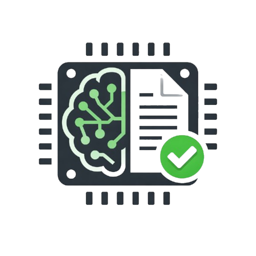

<div align="center">



# NativeLab

**A fully local, privacy-first LLM workbench powered by llama.cpp - desktop GUI, terminal CLI, and an experimentation layer.**

[](https://pypi.org/project/nativelab/)
[](https://pypi.org/project/nativelab/)

[](LICENSE)
[](#)
[](https://github.com/ggerganov/llama.cpp)
[](https://github.com/7ZoneSystems/NativeLab/stargazers)
[](https://github.com/7ZoneSystems/NativeLab/pulls)
[](https://github.com/7ZoneSystems/NativeLab/commits/main)
[](https://github.com/7ZoneSystems/NativeLab/issues)
[](https://github.com/7ZoneSystems/NativeLab/graphs/contributors)
[](https://github.com/7ZoneSystems/NativeLab)
</div>

---

NativeLab is a desktop and terminal client for running large language models entirely on your machine. No API keys, no cloud, no data leaving your computer. It wraps [llama.cpp](https://github.com/ggerganov/llama.cpp) behind a polished PyQt6 GUI **and** a Claude-Code-style terminal CLI, with first-class support for multi-model pipelines, document references, long-document summarization, and a brand-new **Labs** experimentation layer.

```bash
pip install nativelab
nativelab            # GUI
nativelab --cli      # terminal client (interactive setup → chat)
```

---

## ✨ Highlights

- 🖥️  **Desktop GUI** - Chat, model library, visual pipeline builder, MCP, HuggingFace downloader, Labs, theming.
- ⌨️  **Terminal CLI** - `nativelab --cli` opens an interactive setup wizard, downloads a model, and drops you straight into a chat REPL with `@file` embedding, slash commands, and built-in linting.
- 🧪  **Labs** - A dedicated experimentation layer with a shared endpoint API. New lab features get engine status, model swap, context change, and LLM calls for free.
- 🔌  **Integrations** - Local JSON endpoint, route browser, and saved Discord/WhatsApp bot connector profiles.
- 🔗  **Visual Pipeline Builder** - 20 node types (model, transform, branch, loop, custom Python), live execution log, save/load.
- 🌐  **API + local mixing** - OpenAI-compatible and Anthropic endpoints work side-by-side with local GGUFs.
- ⚡  **Parallel + pipeline mode** - Run reasoning + coding engines simultaneously and chain them automatically.
- 🧠  **Auto family detection** - 20+ model families recognised from filename; correct prompt template applied.
- 📦  **HuggingFace downloader** - Search any GGUF repo and pull files without leaving the app.

> See [docs/features.md](docs/features.md) for the full v0.3.0 changelog and [docs/architecture.md](docs/architecture.md) for the layered design.

---

## 📚 Documentation

The docs are split into short, focused files so you can jump straight to what you need.

| Page | What's inside |
|---|---|
| [docs/README.md](docs/README.md) | Documentation index with one-line summaries. |
| [docs/installation.md](docs/installation.md) | Install, llama.cpp setup, first-time workspace. |
| [docs/cli.md](docs/cli.md) | `nativelab --cli` - quick reference + link to the beginner guide. |
| [docs/features.md](docs/features.md) | What's new in v0.3.0 + the full feature catalogue. |
| [docs/architecture.md](docs/architecture.md) | Layered architecture, project structure, data flow. |
| [docs/labs.md](docs/labs.md) | The Labs experimentation layer + how to add a feature. |
| [docs/integrations.md](docs/integrations.md) | Integration endpoint routes, local HTTP bridge, Discord and WhatsApp bot connectors. |
| [docs/models.md](docs/models.md) | Model registry, families, quantization, API models. |
| [docs/workflows.md](docs/workflows.md) | Pipelines, references, summarization, MCP, HF downloads. |
| [docs/ui.md](docs/ui.md) | GUI tour, theming, shortcuts, data persistence. |
| [docs/troubleshooting.md](docs/troubleshooting.md) | Common errors and their fixes. |

Beginner-friendly walkthroughs:

- 🆕 **Never used a terminal LLM tool?** Start with [nativelab/cli/cli_guide.md](nativelab/cli/cli_guide.md).
- 🆕 **Want to add a lab feature?** Read [docs/labs.md](docs/labs.md).

---

## ⚡ Quick start

### GUI

```bash
pip install nativelab
nativelab
```

The first launch opens the desktop app. Use the **Download** tab to install llama.cpp binaries and grab a GGUF model - no manual setup required.

### CLI

```bash
pip install nativelab
nativelab --cli
```

The CLI runs an interactive wizard the first time:

1. Verifies `llama-server` / `llama-cli` are present (or guides you to install them).
2. Lets you pick or download a GGUF model from HuggingFace.
3. Asks for a context size with sensible defaults.
4. Drops you into a chat REPL with `@file` embedding and slash commands.

```text
you ▸ explain what @nativelab/labs/endpoints.py does
bot ▸ It's the shared surface every Labs panel uses to talk to engines…
you ▸ /lint nativelab/cli/chat.py
✓  [pyflakes]  nativelab/cli/chat.py - clean
you ▸ /quit
```

Full beginner walkthrough: [nativelab/cli/cli_guide.md](nativelab/cli/cli_guide.md).

---

## 🧪 Labs - the experimentation layer

The `nativelab/labs/` package is a sandbox for new features. Every lab panel receives a single `LabEndpoints` instance and uses it for **all** engine interaction:

```python
from nativelab.labs import LabEndpoints

# Read state
endpoints.status_text     # "🟢 Server  :8612"
endpoints.model_path      # "/abs/path/to/mistral-7b.Q4_K_M.gguf"
endpoints.snapshot()      # {model_name, ctx_value, server_port, …}

# Synchronous LLM call - auto-routes API > server > CLI
endpoints.call_llm(messages=[...], system_prompt="…")

# Reverse routing - ask the host app to change state
endpoints.request_load_model("/path/to/other.gguf")
endpoints.request_context(8192)
endpoints.request_unload()
```

Add a lab feature by dropping `nativelab/labs/<feature>.py` with a `QWidget` panel that has `LAB_NAME`, `LAB_ICON`, and a `set_endpoints(...)` method, then appending it to `LAB_FEATURES`. Full guide in [docs/labs.md](docs/labs.md).

---

## 🛠️ Requirements

- **Python 3.10+**
- **PyQt6** (installed automatically as a dependency)
- **llama.cpp binaries** - `llama-server` / `llama-cli`. The GUI's Download tab installs these for you, or you can drop them in `./llama/bin/`.
- Optional: `psutil` (RAM monitor), `PyPDF2` (PDF summarization), `pyflakes` / `flake8` / `pylint` (CLI lint).

Detailed instructions in [docs/installation.md](docs/installation.md).

---

## 🤝 Contributing

Issues and PRs welcome. See [CONTRIBUTING.md](CONTRIBUTING.md) and [CODE_OF_CONDUCT.md](CODE_OF_CONDUCT.md).

For security disclosures, see [SECURITY.md](SECURITY.md).

---

## 📜 License

AGPL v3 - see [LICENSE](LICENSE). NativeLab depends on [llama.cpp](https://github.com/ggerganov/llama.cpp) (MIT) and [PyQt6](https://www.riverbankcomputing.com/software/pyqt/) (GPL/commercial).

---

<div align="center">

**Built for people who want their LLMs local, fast, and under their own control.**

[Install from PyPI](https://pypi.org/project/nativelab/) · [GitHub](https://github.com/7ZoneSystems/NativeLab) · [Docs](docs/README.md) · [Issues](https://github.com/7ZoneSystems/NativeLab/issues)

</div>
